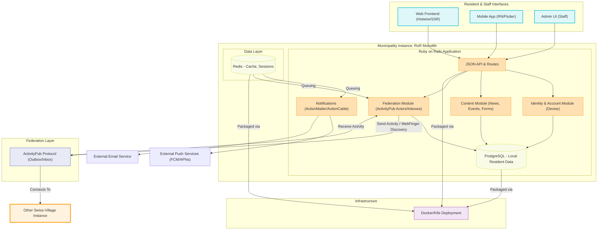

```mermaid

graph TD
    %% Define Styles
    classDef client fill:#e0f7fa,stroke:#00bcd4,stroke-width:2px;
    classDef instance fill:#fff3e0,stroke:#ff9800,stroke-width:3px;
    classDef module fill:#ffe0b2,stroke:#ff9800;
    classDef db fill:#f9fbe7,stroke:#cddc39;
    classDef fed fill:#e8eaf6,stroke:#3f51b5;
    classDef infra fill:#f3e5f5,stroke:#9c27b0;

    %% A. Clients
    subgraph Clients [Resident & Staff Interfaces]
        C_WEB["Web Frontend (Hotwire/SSR)"]:::client
        C_MOBILE["Mobile App (RN/Flutter)"]:::client
        C_ADMIN["Admin UI (Staff)"]:::client
    end

    %% B. Core Instance (The Modular RoR Monolith)
    subgraph Swiss_Village_Instance [Municipality Instance: RoR Monolith]
        direction LR

        %% B1. Internal Modules
        subgraph Rails_App [Ruby on Rails Application]
            M_API["JSON API & Routes"]:::module
            M_AUTH["Identity & Account Module (Devise)"]:::module
            M_CONTENT["Content Module (News, Events, Forms)"]:::module
            M_FED["Federation Module (ActivityPub Actors/Inboxes)"]:::module
            M_NOTIFY["Notifications (ActionMailer/ActionCable)"]:::module

            M_API --> M_AUTH
            M_API --> M_CONTENT
            M_API --> M_FED

            M_AUTH --> D_POSTGRES
            M_CONTENT --> D_POSTGRES
            M_FED --> D_POSTGRES
        end

        %% B2. Data Layer
        subgraph Data_Layer [Data Layer]
            D_POSTGRES[(PostgreSQL - Local Resident Data)]:::db
            D_REDIS[(Redis - Cache, Sessions)]:::db
            D_REDIS -- Queuing --> M_NOTIFY
            D_REDIS -- Queuing --> M_FED
        end
    end

    %% C. Federation & Deployment (ActivityPub)
    subgraph Federation_Layer [Federation Layer]
        F_AP["ActivityPub Protocol (Outbox/Inbox)"]:::fed
    end

    subgraph Infrastructure [Infrastructure]
        INF_DOCKER["Docker/K8s Deployment"]:::infra
    end

    %% Connections
    C_WEB --> M_API
    C_MOBILE --> M_API
    C_ADMIN --> M_API

    %% Federation Flow
    M_FED -- Send Activity / WebFinger Discovery --> F_AP
    F_AP -- Receive Activity --> M_FED

    %% External Connectivity
    M_NOTIFY --> PUSH["External Push Services (FCM/APNs)"]
    M_NOTIFY --> EMAIL["External Email Service"]

    F_AP -- Connects To --> SVI_2["Other Swiss-Village Instance"]:::instance

    M_API -- Packaged via --> INF_DOCKER
    D_POSTGRES -- Packaged via --> INF_DOCKER
    D_REDIS -- Packaged via --> INF_DOCKER

```